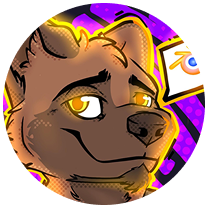
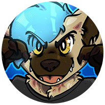
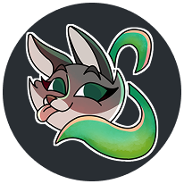

Mission Hexalife
---

## A investigative interactive-novel game
Mission HeXalife is an open-collaborative, interactive-novel game with investigation mechanics.

## 📖 Introduction
In a dystopian future where the Earth has reached overpopulation of over 20 billion, the planet doesn't produce enough 
resources to sustain life. Humanity's morbid desire to survive will born the HeXalife mission.

## 🎮 How to Play
> 📢
> The game is in early _development_, this section should describe the current playable state.

TBD

## ✨ Features
Developed features include:
- TBD

## 📜 License
This project is licensed under the **GNU General Public License v3.0**.

See the full [LICENSE](./LICENSE) file for more details.

---
## 🪪 About Us
This is our first experience of Game Development with the help of our small community.

The main objective is help our creators to expand their portfolio with something of revaluable and shared.

Further details about our Team and updates about the state of the development will dropped in the DevLog section.

---
## 🏆 Credits
Thanks to [orlandoo](https://orlandoo.itch.io/) who create the [Portfolio Builder Jam](https://orlandoo.itch.io/portfolio-builders-jams) and this opportunity.

Thanks to our **Community Collaborators**:

|                                                      Contributor                                                       | Main Role                                                        | Additional Role     |
|:----------------------------------------------------------------------------------------------------------------------:|:-----------------------------------------------------------------|:--------------------|
|    [<br/>JervNorsk](https://linktr.ee/jervnorsk)    | Creator & Lead Architect                                         | Community Director  |
|   [<br/>Feona](https://www.twitch.tv/grumpywolverine)   | Associate Director                                               |                     |
| [<br/>Chinni2D](https://www.instagram.com/chinni2d/) | Concept Artist / Environment and Character Designer, Illustrator |                     |
|       [<br/>Raino98](https://linktr.ee/raino98)       | Graphic Designer, Project Coordinator                            | Community Manager   |
|       [<br/>Skaiira](https://skaiira.carrd.co)        | Graphic Designer                                                 |                     |

Each contributor has the transversal role of **Creative Contributor**.

---
## 🤝 Contributing
We believe in open-collaboration! This project is an entirely open-collaborative effort with our community. 

Every bug report, feature suggestion or line of code heps to improve the experience of all.

Fell free to drop a feedback or join directly in the development process from our Discord server.

<a href="https://discord.gg/qq2xXPNPxg" target="_blank">
   
</a>


## 🛠️ Getting Started
The project is designed to be portable and easy accessible to each collaborator.

### Prerequisites
We chosen small development tool with multiplatform support to setup in the right way the project.

Install manually these tools:

| Tool                          | Installation                                                                           | Scope    |
|-------------------------------|----------------------------------------------------------------------------------------|----------|
| [Git](https://git-scm.com/)   | [Offical Documentation](https://git-scm.com/book/en/v2/Getting-Started-Installing-Git) | VCS      |
| [Mise](https://mise.jdx.dev/) | [Official Documentation](https://mise.jdx.dev/getting-started.html)                    | Dev Tool |


### Installation

1. **Clone the Repository** - open your terminal and clone the main branch:
    ```shell
    git clone https://github.com/EilertenStudio/mission-hexalife.git
    cd mission-hexalife
    ```
1. **Project Setup** - from the root of the repository run:
    ```shell
    mise setup
    ```
   This task will install a local version of:

   | Tool                                     | Scope       |
   |------------------------------------------|-------------|
   | [Gradle](https://gradle.org/)            | Dev Tool    |
   | [Godot Engine](https://godotengine.org/) | Game Engine |


### Work on Project

This project supports different way to edit the project. In
   
#### Godot Editor
1. From the root of the repository run:
    ```shell
    mise godot:editor
    ```

#### IntelliJ IDEA
1. From the root of the repository run:
   ```shell
   idea .
   ```
